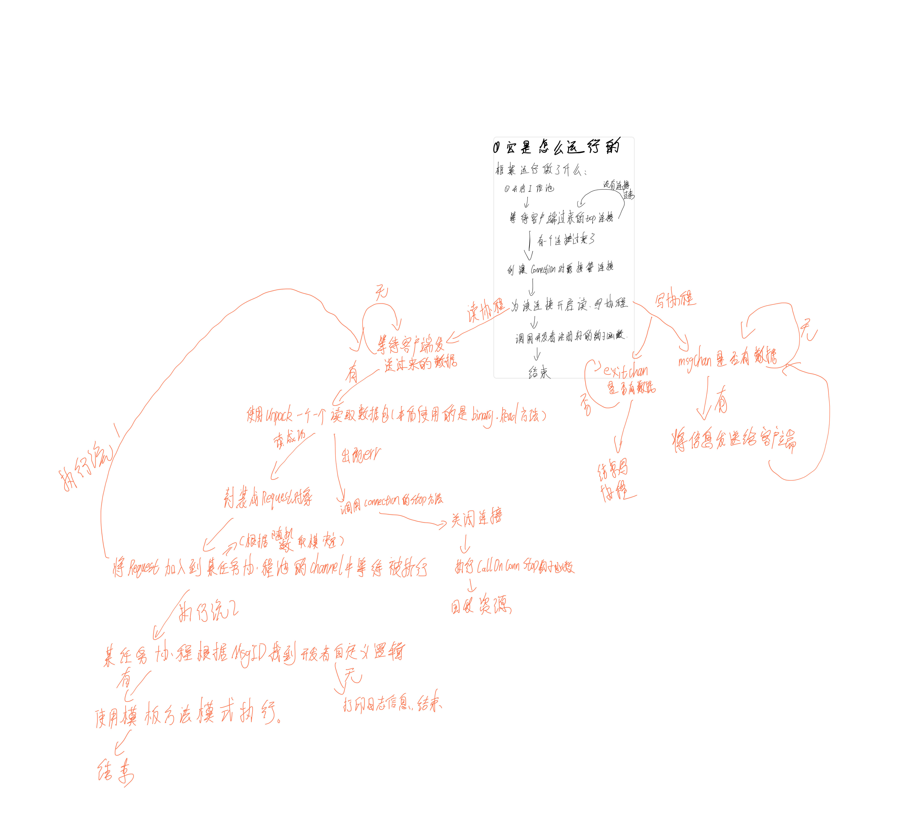

# 快速开始

## 服务端代码

```go
package main

import (
	"fmt"
	"github.com/linyerun/zinx/ziface"
	"github.com/linyerun/zinx/znet"
)

func main() {
	server := znet.NewServer()
	//添加自定义处理器
	server.AddHandler(0, new(MyHandler01))
	server.AddHandler(1, &MyHandler02{})
	//自定义连接前、后的钩子函数
	server.AddOnConnStart(func(connection ziface.IConnection) {
		if err := connection.SetProperty("哈哈", "哇哇"); err != nil {
			fmt.Printf("给ConnID=%v设置属性失败\n", connection.GetConnID())
			return
		}
		fmt.Printf("给ConnID=%v设置属性成功\n", connection.GetConnID())
	})
	server.AddOnConnStop(func(connection ziface.IConnection) {
		p, err := connection.GetProperty("哈哈")
		if err != nil {
			fmt.Println(err)
		}
		fmt.Println("=====>", p.(string))
		fmt.Println("call OnConnStop hook,", connection.GetTCPConnection().RemoteAddr(), "stop")
	})
	server.Serve()
}

type MyHandler01 struct {
	znet.BaseHandler
}

func (r *MyHandler01) Handle(req ziface.IRequest) {
	//实现回显功能
	b := []byte("服务端[0]回显信息：" + string(req.GetData()))
	if err := req.GetConnection().SendMsg(1, b); err != nil {
		fmt.Println("write back buf err :", err)
	}
	return
}

type MyHandler02 struct {
	znet.BaseHandler
}

func (r *MyHandler02) Handle(req ziface.IRequest) {
	//实现群发功能
	b := []byte("群发信息：" + string(req.GetData()))
	req.GetConnection().SendMsgToAll(1, b)
	return
}
```

## 客户端代码

```go
package main

import (
	"fmt"
	"github.com/linyerun/zinx/znet"
	"net"
)

func main() {
	// 获取连接
	conn, err := net.Dial("tcp4", "127.0.0.1:8999")
	if err != nil {
		panic(err)
	}
	// 关闭连接
	defer func() {
		if err := conn.Close(); err != nil {
			panic(err)
		}
	}()
	dataPack := znet.NewDataPack()
	// 写信息
	go func() {
		bytes, err := dataPack.Pack(znet.NewMessage(0, []byte("我是客户端,服务端你好")))
		if err != nil {
			panic(err)
		}
		if _, err = conn.Write(bytes); err != nil {
			panic(err)
		}
	}()
	go func() {
		bytes, err := dataPack.Pack(znet.NewMessage(1, []byte("我是客户端,服务端你好哇")))
		if err != nil {
			panic(err)
		}
		if _, err = conn.Write(bytes); err != nil {
			panic(err)
		}
	}()
	// 读信息
	go func() {
		for {
			message, err := dataPack.Unpack(conn)
			if err != nil {
				panic(err)
			}
			fmt.Println(message.GetMsgId(), message.GetDataLen())
			fmt.Println(string(message.GetData()))
		}
	}()
	select {}
}
```

# 框架的大致运行逻辑图


# 包说明
- global_properties: 里面放了全局属性，这个全局属性开发者可以在文件 `/config/zinx.json` 中配置。
  - 它的初始化会在用户使用`NewServer` 方法的时候开始。
- ziface: 框架的接口都聚集在这个包里面
- znet: 接口的实现类都聚集在此包内
  - Server: 框架的心脏
  - Connection: 连接的封装
  - ConnsManager: 所有连接由它管理
  - Message: 连接的客户端发送过来的信息最好被封装成这个对象
  - DataPack: 封包、拆包。使得Message和[]byte得以相互转换
  - Request: Message和Connection合并形成
  - ReqProcessingCenter: 请求管理中心。开启、管理任务协程池，MsgID对应的处理器由它获得，Request的执行由它分配协程。
  - BaseHandler: 为开发者自定义Handler提供方便

# 功能介绍
- 自定义处理器处理客户端发送过来连接信息(Message)
  - 根据msgId决定使用哪个自定义Handler来处理
- 给连接自定义钩子函数
